<h1> PicBox </h1>

A simple gallery app for Android

## What does this app do?
This gallery app helps you manage and view your photos with a straightforward UI. Simple yet powerful at the same time.

## Highlighted features

- View all of your photos, videos and GIFs
- Ability to hide photos in a secret album
- Ability to make photo as favourite photo for quick access
- Advanced photo editor
- Config app's settign (language, grid mode, span count, ...)
- Set photo as background cover
- Share image
- Read info of photo
- Slide show (add music, repeat, animation, ...)
- Delete image
- Display location in Gooogle map

## Compatibility

+ MinSDK: 30
+ TargetedSDK: 31

+ This app will work properly on devices without any Google service installed.

## Demo

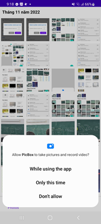
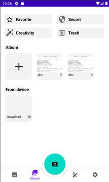
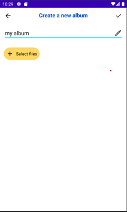
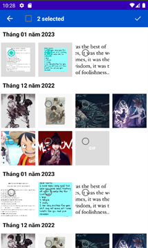
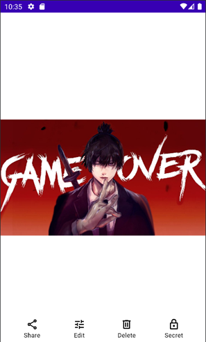
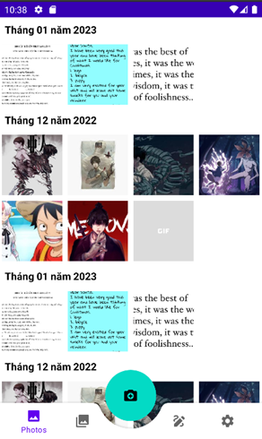
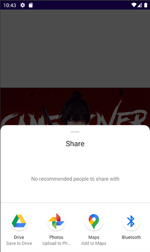

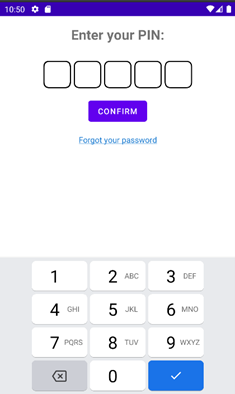
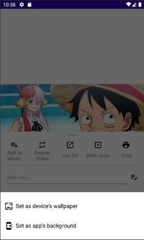
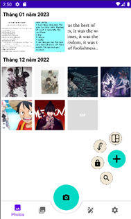
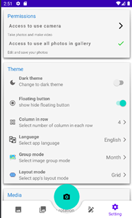
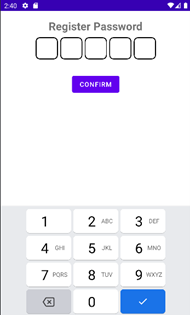
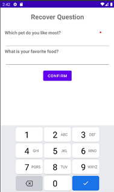
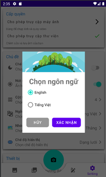
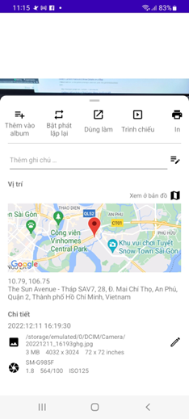
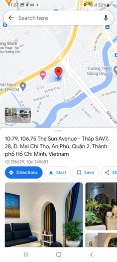
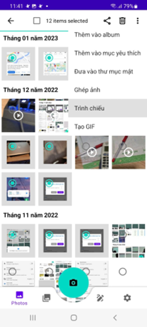
